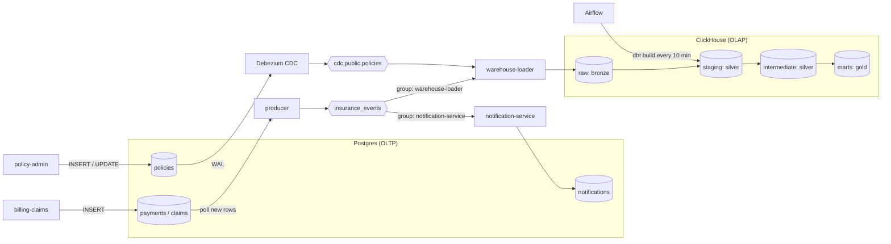
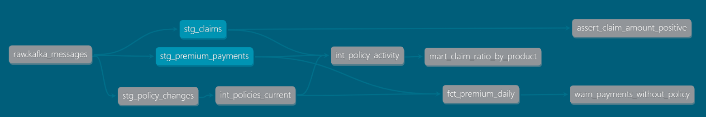

# Insurance Event Pipeline

A containerized pub/sub system built with Kafka and Python, with dbt models that turn raw insurance events into dashboard-ready tables.

```bash
docker compose up -d --build     # requires Docker Desktop with about 4 GB of memory
```

Within about a minute, data is flowing and Airflow (http://localhost:8080) refreshes the warehouse every 10 minutes. See [Running the project](#running-the-project) for details.

It simulates a small insurer:

- A **policy admin system** issues policies and sometimes changes their status.
- A **billing & claims system** records premium payments and claims.
- Both business systems only write to their own database. Two change-data-capture mechanisms move the committed changes into Kafka: **Debezium** (log-based) for policies, and a **Python polling producer** for payments and claims.
- The events are delivered to two independent consumers: a **notification service** (OLTP) and a **warehouse loader** (OLAP).
- **dbt**, orchestrated by **Airflow**, builds analytics tables from the warehouse data.

## Architecture



## Design decisions and trade-offs

### 1. Two business systems

The homework defines two business systems. These definitions are assumptions made for this exercise, not a claim about how a real insurer works:

| 系統 | 模擬的業務 | 寫入的資料表 | 資料的變化方式 | 進入 Kafka 的方式 | 下游需求 |
|---|---|---|---|---|---|
| 保單系統 `policy-admin` | 新增保單、停效、解約 | `policies` | **會被修改**（狀態從有效變成停效／解約） | Debezium（log-based CDC） | 倉儲分析（有效保單數、保單狀態） |
| 繳費理賠系統 `billing-claims` | 客戶繳交保費、提出理賠 | `payments`、`claims` | **只會新增**（寫入後不會再修改） | Python polling producer | 理賠需要**立即通知客戶**（OLTP），同時進入倉儲分析（OLAP） |

Having two systems serves several purposes:

1. **Multiple upstream sources.** The claim ratio mart needs policies, payments, and claims, which is the "A & B & C → D" case: D must only be built when all of its inputs are correct (see [decision 8](#8-guaranteeing-upstream-correctness-a--b--c--d)).
2. **Two change patterns, two capture methods.** Mutable data (policies) and append-only data (payments/claims) are best captured in different ways (see [decision 3](#3-getting-database-changes-into-kafka-cdc-polling-or-outbox)).
3. **Two kinds of consumers.** A claim must trigger a customer notification right away, exactly once per claim (an OLTP concern). All events also feed the warehouse, where correctness is only needed after the next dbt run (an OLAP concern).

### 2. Business systems never publish to Kafka themselves

**The business systems are separate from the components that publish to Kafka.** `policy-admin` and `billing-claims` only write to Postgres and contain no Kafka code. They stand in for legacy or core systems owned by other teams, whose code the data team usually cannot change. Getting their data into Kafka is the data team's job: Debezium and the polling producer are the data team's components.

This separation also avoids the **dual-write problem**. If an application writes to its database and then publishes to Kafka, the two steps can diverge when one fails, because a database transaction cannot include the Kafka publish. Here, only data that has already been **committed** to the database is published.

### 3. Getting database changes into Kafka: CDC, polling, or outbox

| 方式 | 原理 | 優點 | 缺點 | 適合的情況 |
|---|---|---|---|---|
| **Log-based CDC**（Debezium，本專案用於保單） | 讀取資料庫的異動日誌（Postgres WAL），把每一筆 INSERT／UPDATE／DELETE 轉成事件 | 不需修改業務系統；拿得到**修改前後的值**與**刪除**；不對資料表下查詢，來源負擔低；延遲低 | 需要資料庫權限與設定（`wal_level=logical`、replication slot）；多一套元件要維運；CDC 停太久時 WAL 會堆積，可能塞滿來源資料庫的磁碟；下游依賴來源的內部表結構 | 會被修改的資料；無法修改的既有系統 |
| **Polling**（Python producer，本專案用於繳費理賠） | 定期查詢 `id`（或 `updated_at`）大於 checkpoint 的資料 | 實作簡單、只需讀取權限；容易理解與除錯 | 看不到刪除，也看不到兩次查詢之間的中間狀態；拿不到修改前的值；定期查詢會增加來源負擔；多個交易同時寫入時，id 較小的交易可能較晚 commit 而被漏掉 | **只會新增**的資料表 |
| **Transactional Outbox** | 業務系統在**同一個 transaction** 裡寫入業務資料和 `outbox` 表，再由 CDC 或 polling 把 `outbox` 送進 Kafka | 事件內容由業務定義（明確的事件合約），不受內部表結構變動影響；業務資料與事件保證一致 | **需要修改業務系統**；`outbox` 表需要定期清理 | 業務系統可以修改，而且需要穩定事件合約的情況 |

**Why polling is not used for policies.** Polling a table that gets updated requires an `updated_at` column that every write reliably maintains, with an index on it, so that the poller can find changed rows. Even then:

- deleted rows are invisible, unless the system switches to soft deletes;
- several updates between two polls collapse into the last state, so status transitions are lost;
- the previous values are never available.

Policies change status, so they use log-based CDC. `REPLICA IDENTITY FULL` makes each update carry the full previous row (for example `previous_status`). Payments and claims are never updated, so polling by an increasing `id` is sufficient.

### 4. Semi-structured data and schema-on-read

Claims carry a **semi-structured** part: a nested object with a free-text description and an array of documents.

```json
"payload": {
  "claim_id": "CLM-2d193350b9",
  "policy_id": "P000016",
  "claim_amount": 36151,
  "claim_detail": {
    "category": "surgery",
    "description": "Customer reported surgery case",
    "documents": ["receipt", "diagnosis_certificate"]
  }
}
```

- **The loader does not parse messages.** `raw.kafka_messages` stores each message value as a raw string, together with its Kafka coordinates. Adding a topic or changing an event schema requires no loader change, and malformed messages are kept for inspection instead of being lost.
- **dbt parses the JSON when reading it (schema-on-read).** `stg_claims` flattens the nested object into columns and turns the array into a typed column:

  ```sql
  JSONExtractString(message_value, 'payload', 'claim_detail', 'category')                   as claim_category,
  JSONExtract(message_value, 'payload', 'claim_detail', 'documents', 'Array(String)')       as documents,
  length(documents)                                                                          as document_count,
  ```

- **New fields are non-breaking.** A new field in the source is kept in raw automatically, and it becomes available once a staging model extracts it.
- On BigQuery, the same approach uses a `JSON` column with `JSON_VALUE` / `JSON_QUERY`, and `UNNEST` for arrays.

### 5. Ordering: the message key is `policy_id`

All events of one policy go to the same partition, so their relative order is preserved. Debezium uses the table's primary key (`policy_id`) as the key for the same reason. Ordering across different policies is not guaranteed, and it is not needed.

### 6. At-least-once delivery, and two kinds of duplicates

Both data movers follow the same rule: finish the work, then record progress.

- The producer saves its checkpoint only after Kafka has acknowledged every published event.
- The loader commits Kafka offsets only after the batch has been written to ClickHouse.

A crash between the two steps causes a re-publish or a re-read, never data loss. Exactly-once semantics (Kafka transactions) would add a lot of complexity for little gain, because duplicates are cheap to remove later.

Duplicates therefore have to be handled, and there are two different kinds:

| 識別碼 | 回答的問題 | 什麼情況下會重複 | 在哪裡處理 |
|---|---|---|---|
| **`event_id`**（技術上的 key：同一則訊息） | 「這是不是同一則訊息？」 | **搬運過程**造成的重複：<br>① producer 在 publish 之後、存 checkpoint 之前當機 → 同一列再送一次<br>② producer 重試（Kafka 已經收到，但確認回應遺失）<br>③ loader 在寫入之後、commit offset 之前當機 → 重讀同一個 offset<br>④ dbt 的 lookback 窗口重讀近期的資料 | dbt staging：`row_number()` 依 `event_id` 只保留一份，增量更新時依 `unique_key` 覆蓋；`unique` 測試把關 |
| **`claim_id` / `payment_id`**（業務上的 key：同一件事） | 「這是不是同一件事？」 | **業務操作或系統問題**造成的重複：<br>① 系統重試時，用同一個編號再寫入一次<br>② 將來有多個來源系統送來同一筆資料 | ① 來源資料庫的 `unique` 約束（第一道防線）<br>② 通知服務：`notifications.claim_id` 唯一，**寄出通知前**就擋下<br>③ dbt 的 `unique` 測試（倉儲不信任上游的約束） |

- `event_id` is generated **once**, when the row is written, and stored on it (`payments.event_id`, `claims.event_id`). Re-publishing the same row therefore produces the same `event_id`. An id generated at publish time would change on every retry and make deduplication impossible.
- **The OLTP side rejects duplicates immediately, while the OLAP side cleans them up later.** A sent email cannot be taken back, so the notification service checks the unique `claim_id` in the same transaction as the send. ClickHouse, like BigQuery, does not enforce primary keys, so the warehouse keeps raw rows as they arrive and deduplicates in dbt.
- Two separate claims for the same real-world event, with **different** claim numbers, cannot be detected by any id. They need business rules (for example, same policy, same day, same amount) and a manual review.

### 7. Late-arriving data: warn, don't block

A payment can reach the warehouse before its policy, for example when CDC lags behind the polling producer. Blocking the pipeline would delay every report because of one late record. Instead, the payment is reported as `UNKNOWN` and a warning is raised. The marts are fully rebuilt on each run, so the next run resolves the record once the policy arrives. In dimensional modeling, this is a *late-arriving dimension*.

### 8. Guaranteeing upstream correctness (A & B & C → D)

`dbt build` runs models and their tests in dependency order. When a blocking test fails, every model downstream of it is **skipped**, so the mart is never built on bad data. Airflow adds the same guarantee at the task level:

```
source_freshness ─┬→ build_policy  (dbt build --select tag:policy)  ─┬→ build_shared (dbt build --select tag:shared)
                  └→ build_billing (dbt build --select tag:billing) ─┘
```

`build_shared` only runs when both domains succeeded. If one domain fails, `build_shared` becomes `upstream_failed`. `max_active_runs=1` prevents overlapping runs.

### 9. Airflow granularity: one task per business domain

The two domains run in parallel and fail independently. For example, a bad claim stops the billing domain and the shared marts, but policies keep being refreshed.

Airflow can manage dependencies at two levels: **between tasks inside a DAG** (used here), or **between DAGs**. The options considered:

| 做法 | 依賴的層級 | 優點 | 缺點 | 適合的情況 |
|---|---|---|---|---|
| 一個 task 跑完整的 `dbt build` | task | 最簡單 | UI 只看得到成功或失敗；任何錯誤都會讓全部停下來 | 很小的專案 |
| 一層一個 task（staging → intermediate → marts） | task | 簡單；看得出是哪一層失敗 | 一個 staging model 失敗，不相關的下游也會跟著停止 | 單一業務領域 |
| **一個業務領域一個 task（本專案）** | task | 各領域平行執行、失敗互相隔離；共用的 marts 等兩個領域都成功才執行 | 領域內任何一個 model 失敗，整個領域都會停止 | 同一個團隊、同一個排程的多個領域 |
| 一個 model 一個 task（astronomer-cosmos） | task | 重試與可視性最細 | 多一個套件要維護；model 數量多時 DAG 非常龐大 | 需要單獨重跑某個 model |
| 一個業務領域一個 DAG + Asset 排程（**討論，未實作**） | DAG | 各領域有獨立的排程和負責團隊；上游成功才會更新 Asset，下游不會用到壞資料 | 上游失敗時，下游只是「不更新」而不會報錯，**一定要搭配 freshness 監控** | 多個團隊、排程不同、一個上游供應多個下游（財務、精算、行銷） |

With one DAG per domain, the shared marts would move to their own DAG and be triggered by **asset-aware scheduling**:

```python
# policy DAG:  BashOperator(..., bash_command="dbt build --select tag:policy",  outlets=[Asset("policy_models")])
# billing DAG: BashOperator(..., bash_command="dbt build --select tag:billing", outlets=[Asset("billing_models")])
# marts DAG:   runs once BOTH assets have been updated
with DAG(dag_id="insurance_marts", schedule=[Asset("policy_models"), Asset("billing_models")]): ...
```

Other cross-DAG options: `ExternalTaskSensor` requires the DAG schedules to line up, and `TriggerDagRunOperator` cannot express "wait for both".

dbt runs in its own virtualenv inside the Airflow image, so its dependencies cannot conflict with Airflow's.

### 10. Why ClickHouse for a BigQuery shop?

ClickHouse is a columnar OLAP engine that runs locally in Docker. It shares the properties that shaped this design: no enforced primary keys, append-friendly storage, and a preference for batched inserts. Swapping it for BigQuery mainly changes the dbt adapter and the SQL functions, not the architecture (see [Moving to Google Cloud](#moving-to-google-cloud)).

## Event contract

All application events share one envelope, and the message key is `policy_id`:

```json
{
  "event_id": "uuid",
  "event_type": "premium_paid | claim_filed",
  "event_ts": "2026-09-16T19:16:12.645716+00:00",
  "schema_version": 1,
  "payload": { "...": "type-specific fields" }
}
```

- `event_id` comes from the source row and is stable across re-publishing (see [decision 6](#6-at-least-once-delivery-and-two-kinds-of-duplicates)).
- `event_ts` is the business time of the row (`paid_at`, `filed_at`), not the time it was published.
- Policy changes use Debezium's envelope instead (`op`, `before`, `after`, `source.lsn`).

## Data model (Medallion layers)

<!-- lineage graph -->


| 層 | Medallion | Models | 物化方式 | 說明 |
|---|---|---|---|---|
| **raw** | Bronze | `raw.kafka_messages` | 由 loader 寫入（append-only） | 原樣保存所有 topic 的訊息，包含重複和格式錯誤的資料，可以追溯、可以重新處理 |
| **staging** | Silver | `stg_premium_payments`、`stg_claims`、`stg_policy_changes` | **Incremental**（`delete+insert`，10 分鐘 lookback） | **為什麼用增量**：來源是只會新增的事件，最適合增量。每次只解析新進的 raw 資料，JSON 解析的成本高，在 BigQuery 上也等於只掃描、只付費這一部分。lookback 窗口涵蓋較晚寫入的批次，重讀到的資料依照 `unique_key` 覆蓋，不會重複 |
| **intermediate** | Silver | `int_policies_current`、`int_policy_activity` | Table（全量） | **為什麼不用增量**：這一層會改變粒度（從異動歷史取出最新狀態、彙總）並 join 多個來源。結果的資料量小，全量重建最簡單、最不容易出錯 |
| **marts** | Gold | `fct_premium_daily`、`mart_claim_ratio_by_product` | Table（全量） | **為什麼不用增量**：dashboard 用的彙總表。全量重建能讓晚到的資料在下一輪自動被修正，也避免增量彙總容易出錯的問題 |

- **staging vs intermediate:** a staging row always equals one source record, and staging only cleans (types, JSON parsing, deduplication). Once data is joined or its grain changes (latest state, aggregates), it belongs in intermediate.
- **Folders define the layer; tags define the business domain**, and the domain is what Airflow schedules:

  | Tag | Models |
  |---|---|
  | `policy` | `stg_policy_changes`, `int_policies_current` |
  | `billing` | `stg_premium_payments`, `stg_claims` |
  | `shared` (needs both domains) | `int_policy_activity`, `fct_premium_daily`, `mart_claim_ratio_by_product` |

- **Mart columns are documented** in `_marts.yml`, and `persist_docs` writes the descriptions into ClickHouse as table and column comments.

Data quality checks, all run automatically by `dbt build`:

- Generic tests: `unique` and `not_null` on technical and business keys, and `accepted_values` on enumerations.
- `assert_claim_amount_positive` (**error**): invalid claims block the models downstream of `stg_claims`.
- `warn_payments_without_policy` (**warn**): flags payments whose policy has not arrived yet, without blocking the pipeline.
- Source freshness on `raw.kafka_messages`: warn after 15 minutes without new data, error after 60 minutes.

### Analytical assumptions

- Premiums are paid monthly (`annual_premium / 12`).
- `claim_ratio = claim amount filed / premium collected` is a simplified indicator, not an actuarial loss ratio. The data is synthetic and the policies are only minutes old, so the values are far from realistic.
- A payment whose policy has not arrived yet is reported as `product_code = 'UNKNOWN'`.

## Running the project

Requirements: Docker Desktop with about 4 GB of memory.

```bash
docker compose up -d --build
```

Within about a minute, all services are running and data is flowing. Airflow runs the dbt pipeline every 10 minutes. To run it immediately:

```bash
docker compose exec airflow dbt build
```

| Service | URL / port | Notes |
|---|---|---|
| Airflow UI | http://localhost:8080 | No login (local demo) |
| ClickHouse | http://localhost:8123 | user `analytics` / password `analytics` |
| Postgres | localhost:5433 | user `app` / password `app`, database `insurance_app` |
| Kafka | localhost:29092 | |
| Kafka Connect REST | http://localhost:8083 | `GET /connectors/policies-cdc/status` |

To query the dashboard tables:

```bash
docker compose exec clickhouse clickhouse-client -u analytics --password analytics \
  -q "select * from marts.mart_claim_ratio_by_product format PrettyCompact"
```

To run the unit tests:

```bash
docker run --rm -v "$PWD:/work" -w /work python:3.12-slim \
  sh -c "pip install -q -r requirements-dev.txt && python -m pytest -q"
```

To stop everything and delete all data: `docker compose down -v`.

### Services

| Service | Role |
|---|---|
| `kafka`, `kafka-init` | Single KRaft broker (no ZooKeeper). `kafka-init` creates the topics explicitly; auto-creation is disabled. |
| `postgres` | OLTP database: `policies`, `payments`, `claims`, `notifications`, and the producer's `publisher_checkpoints`. Also stores Airflow metadata in a separate database. |
| `clickhouse` | OLAP warehouse. |
| `connect`, `connect-init` | Debezium on Kafka Connect. `connect-init` registers the connector through the REST API (`PUT` is idempotent). |
| `policy-admin` | Issues a policy every few seconds; about 10% of ticks lapse or surrender an existing policy instead. |
| `billing-claims` | Records a payment or a claim (about 10%) for a random active policy, twice per second. |
| `producer` | Polling publisher. Every second, it reads new `payments` / `claims` rows, publishes them as `premium_paid` / `claim_filed` events, and then saves its checkpoint. |
| `warehouse-loader` | Consumer group `warehouse-loader`. Batches messages from both topics into `raw.kafka_messages`. |
| `notification-service` | Consumer group `notification-service`. Notifies the customer once per claim. |
| `airflow` | Runs dbt per business domain every 10 minutes. |

## Demo scenarios

Each scenario is deterministic and can be triggered on demand.

### 1. Producer crash between publish and checkpoint (duplicate events)

```bash
docker compose stop producer          # new payments/claims pile up in Postgres
docker compose run --rm -e CRASH_AFTER_PUBLISH=true producer   # publishes the backlog, exits before saving checkpoints
docker compose start producer         # publishes the same rows again, with the same event_id
```

- `raw.kafka_messages` contains two copies of each re-published event.
- The notification service logs `skip claim ...: customer already notified` for the re-published claims, and `notifications` still has one row per claim.
- After `dbt build`, staging has one row per `event_id`.

### 2. Consumer crash between write and commit (re-read)

```bash
docker compose stop warehouse-loader
docker compose run --rm -e CRASH_AFTER_WRITE=true warehouse-loader   # writes one batch, exits before committing
docker compose start warehouse-loader
```

The restarted loader waits for the crashed member's session to time out (`session.timeout.ms`, 45 s by default). It then re-reads the uncommitted batch, and `raw.kafka_messages` contains the same `(topic, partition, offset)` twice. Staging tests still pass after `dbt build`.

### 3. Late-arriving policy

```bash
docker compose run --rm billing-claims python scenario.py late --delay 120
```

A payment is recorded for a policy that will only be created 120 seconds later.
- A dbt run during the delay reports `WARN 1 warn_payments_without_policy`, and `fct_premium_daily` has an `UNKNOWN` row.
- Once the policy arrives through CDC, the next dbt run resolves it, and the warning disappears.

### 4. Bad data blocks downstream models

```bash
docker compose run --rm billing-claims python scenario.py bad-claim
docker compose exec airflow dbt build
```

- `assert_claim_amount_positive` fails.
- `int_policy_activity` and `mart_claim_ratio_by_product` are **SKIPPED**.
- In Airflow, `build_billing` fails, `build_shared` is `upstream_failed`, and `build_policy` still succeeds.

To recover, remove or correct the bad record, then rebuild:

```bash
docker compose exec clickhouse clickhouse-client -u analytics --password analytics --multiquery -q \
  "delete from raw.kafka_messages where message_value like '%CLM-BAD-%';
   delete from staging.stg_claims where claim_id like 'CLM-BAD-%';"
```

## Moving to Google Cloud

| This project | Google Cloud equivalent |
|---|---|
| Kafka | Pub/Sub, or Managed Service for Apache Kafka |
| Python warehouse loader | BigQuery subscription (Pub/Sub → BigQuery), or Dataflow |
| Debezium CDC | Datastream (CDC directly into BigQuery) |
| Postgres (OLTP) | Cloud SQL / AlloyDB |
| ClickHouse | BigQuery |
| Raw message as `String` + `JSONExtract*` | `JSON` column + `JSON_VALUE` / `JSON_QUERY` |
| Incremental `delete+insert` | `merge`, or `insert_overwrite` on date-partitioned tables (BigQuery bills by bytes scanned, so partition pruning matters) |
| Airflow standalone container | Cloud Composer |

## Limitations and next steps

These are situations that could still go wrong and are not solved in this project.

- **A consumer can stop silently (observed while testing).**
  - **What happened:** the stack ran overnight, and the laptop went to sleep. After it woke up, the Kafka broker briefly reloaded its consumer group coordinator. `warehouse-loader` rejoined its group, but `notification-service` never did. Its container was still "running", it logged no errors, and it kept polling with no partitions assigned. It fell 26,000 messages behind before the growing consumer lag gave it away. A restart resumed it from its last committed offset, with no data lost and no duplicate notifications.
  - **Root cause:** not fully identified.
  - **Possible fixes:**
    - alert on consumer lag, rather than trusting container health;
    - add a liveness check that exits the process when it has had no partitions for too long, so that Docker restarts it.
- **Polling producer and concurrent writers:** polling by `id > checkpoint` assumes that ids become visible in the order they were assigned. That holds for the single-writer simulator. With concurrent or longer transactions, a lower id can commit after a higher one and be skipped for good. Production options: log-based CDC for these tables too, or an outbox table relayed by CDC.
- **Observability:** besides consumer lag, production needs monitoring of the Debezium replication slot lag and alerts on Airflow task failures. If Debezium stops, Postgres keeps all unread WAL, which can fill the source database's disk. If a domain keeps failing, the shared marts silently stop refreshing.
- **Airflow:** `airflow standalone` runs every Airflow component in one container and is meant for local use only. Production would use a managed service (Cloud Composer) or a multi-component deployment.

## Project structure

```
.
├── docker-compose.yml
├── postgres/init.sql              # OLTP schema, CDC settings, Airflow database
├── clickhouse/init.sql            # Bronze table
├── cdc/policies-connector.json    # Debezium connector config
├── services/
│   ├── policy_admin/              # simulated policy admin system (OLTP writes)
│   ├── billing_claims/            # simulated billing & claims system (OLTP writes) + demo scenarios
│   ├── producer/                  # polling producer: payments/claims tables -> Kafka
│   └── consumers/                 # warehouse loader, notification service
├── dbt/                           # staging → intermediate → marts, tests
├── airflow/                       # image with dbt venv, DAG
└── tests/                         # unit tests
```
