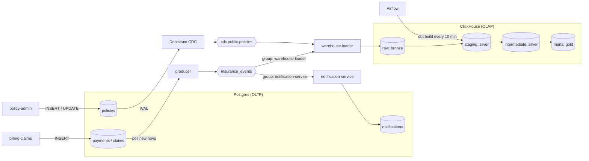

# Insurance Event Pipeline

A containerized pub/sub system built with Kafka and Python, with dbt models that turn raw insurance events into dashboard-ready tables.

It simulates a small insurer:

- A **policy admin system** issues policies and sometimes changes their status.
- A **billing & claims system** records premium payments and claims.
- Both business systems only write to their own database. Two change-data-capture mechanisms move the committed changes into Kafka: **Debezium** (log-based) for policies, and a **Python polling producer** for payments and claims.
- The events are delivered to two independent consumers: a **notification service** (OLTP) and a **warehouse loader** (OLAP).
- **dbt**, orchestrated by **Airflow**, builds analytics tables from the warehouse data.

## Architecture



Neither business system talks to Kafka. The data is moved into Kafka in two ways, depending on how the data changes:

| Data | How it changes | How it reaches Kafka | Why this method |
|---|---|---|---|
| Payments, claims | Append-only (rows are never updated) | **Polling producer** (Python): reads rows with `id` greater than its checkpoint and publishes them | For append-only tables, a query is enough, and it is simple to build and operate |
| Policies | Mutable (active → lapsed / surrendered) | **Log-based CDC** (Debezium): reads the Postgres write-ahead log | A query only sees the current row. The log also carries the previous values (`before`) and deletes |

## Quick start

Requirements: Docker Desktop with about 4 GB of memory.

```bash
docker compose up -d --build
```

Within about a minute, all services are running and data is flowing. Airflow runs the dbt pipeline every 10 minutes. To run it immediately:

```bash
docker compose exec airflow dbt build
```

| Service | URL / port | Notes |
|---|---|---|
| Airflow UI | http://localhost:8080 | No login (local demo) |
| ClickHouse | http://localhost:8123 | user `analytics` / password `analytics` |
| Postgres | localhost:5433 | user `app` / password `app`, database `insurance_app` |
| Kafka | localhost:29092 | |
| Kafka Connect REST | http://localhost:8083 | `GET /connectors/policies-cdc/status` |

To query the dashboard tables:

```bash
docker compose exec clickhouse clickhouse-client -u analytics --password analytics \
  -q "select * from marts.mart_claim_ratio_by_product format PrettyCompact"
```

To run the unit tests:

```bash
docker run --rm -v "$PWD:/work" -w /work python:3.12-slim \
  sh -c "pip install -q -r requirements-dev.txt && python -m pytest -q"
```

To stop everything and delete all data: `docker compose down -v`.

## Services

| Service | Role |
|---|---|
| `kafka`, `kafka-init` | Single KRaft broker (no ZooKeeper). `kafka-init` creates the topics explicitly; auto-creation is disabled. |
| `postgres` | OLTP database: `policies`, `payments`, `claims`, `notifications`, and the producer's `publisher_checkpoints`. Also stores Airflow metadata in a separate database. |
| `clickhouse` | OLAP warehouse. |
| `connect`, `connect-init` | Debezium on Kafka Connect. `connect-init` registers the connector through the REST API (`PUT` is idempotent). |
| `policy-admin` | Issues a policy every few seconds; about 10% of ticks lapse or surrender an existing policy instead. |
| `billing-claims` | Records a payment or a claim (about 10%) for a random active policy, twice per second. |
| `producer` | Polling publisher. Every second, it reads new `payments` / `claims` rows, publishes them as `premium_paid` / `claim_filed` events, and then saves its checkpoint. |
| `warehouse-loader` | Consumer group `warehouse-loader`. Batches messages from both topics into `raw.kafka_messages`. |
| `notification-service` | Consumer group `notification-service`. Notifies the customer once per claim. |
| `airflow` | Runs dbt layer by layer every 10 minutes. |

## Event contract

All application events share one envelope, and the message key is `policy_id`:

```json
{
  "event_id": "uuid",
  "event_type": "premium_paid | claim_filed",
  "event_ts": "2026-09-16T19:16:12.645716+00:00",
  "schema_version": 1,
  "payload": { "...": "type-specific fields" }
}
```

- `event_id` is stored on the source row (`payments.event_id`, `claims.event_id`), so a row that is published again keeps the same `event_id` and can be deduplicated downstream.
- `event_ts` is the business time of the row (`paid_at`, `filed_at`), not the time it was published.
- `claim_filed.payload.claim_detail` is intentionally semi-structured (a nested object with a `documents` array) and is flattened in dbt.

## Data model (Medallion layers)

| Layer | Model | Grain | Materialization |
|---|---|---|---|
| Bronze | `raw.kafka_messages` | One row per Kafka message (may contain duplicates) | Append-only, written by the loader |
| Silver | `staging.stg_premium_payments` | One row per payment event | Incremental (`delete+insert` on `event_id`) |
| Silver | `staging.stg_claims` | One row per claim event | Incremental (`delete+insert` on `event_id`) |
| Silver | `staging.stg_policy_changes` | One row per captured policy change | Incremental (`delete+insert` on `change_id`) |
| Silver | `intermediate.int_policies_current` | One row per policy (latest state) | Table |
| Silver | `intermediate.int_policy_activity` | One row per policy with payment and claim totals | Table |
| Gold | `marts.fct_premium_daily` | Day × product | Table |
| Gold | `marts.mart_claim_ratio_by_product` | Product | Table |

Lineage of the claim ratio mart, which depends on three upstream sources:

```
stg_policy_changes → int_policies_current ─┐
stg_premium_payments ──────────────────────┼→ int_policy_activity → mart_claim_ratio_by_product
stg_claims ────────────────────────────────┘
```

Data quality checks:

- Generic tests: `unique`, `not_null`, `accepted_values` on keys and enumerations.
- `assert_claim_amount_positive` (**error**): invalid claims block the models downstream of `stg_claims`.
- `warn_payments_without_policy` (**warn**): flags payments whose policy has not arrived yet, without blocking the pipeline.
- Source freshness on `raw.kafka_messages`: warn after 15 minutes without new data, error after 60 minutes.

### Analytical assumptions

- Premiums are paid monthly (`annual_premium / 12`).
- `claim_ratio = claim amount filed / premium collected`. This is a simplified indicator, not an actuarial loss ratio: it ignores earned-premium accounting, claim approval, and reserves. The data is synthetic and policies are only minutes old, so the ratios are far above realistic values.
- A payment whose policy is unknown is reported under `product_code = 'UNKNOWN'` until the policy arrives.

## Design decisions and trade-offs

**1. Ordering: the message key is `policy_id`.**
All events of one policy go to the same partition, so their relative order is preserved. Ordering across different policies is not guaranteed, and it is not needed.

**2. At-least-once delivery, made idempotent downstream.**
Both data movers follow the same rule: finish the work, then record progress.
- The producer saves its checkpoint only after Kafka has acknowledged every published event.
- The loader commits Kafka offsets only after the batch has been written to ClickHouse.

A crash between the two steps causes a re-publish or a re-read, never data loss. Exactly-once semantics (Kafka transactions) would add a lot of complexity for little gain, because duplicates are cheap to remove later.

**3. The loader does not parse messages (schema-on-read).**
`raw.kafka_messages` stores the message value as a string, together with its Kafka coordinates. Adding a topic or changing an event schema requires no loader change, malformed messages are kept for inspection instead of being lost, and all parsing lives in version-controlled dbt models.

**4. Duplicates are handled differently in OLTP and OLAP.**
- **Notification service (OLTP):** a duplicate must be rejected before any side effect, because a sent email cannot be taken back. The unique `claim_id` insert and the send happen in the same transaction.
- **Warehouse (OLAP):** ClickHouse, like BigQuery, does not enforce primary keys. Raw rows are kept as-is, and staging deduplicates by `event_id` (or `policy_id + lsn` for CDC). A report only needs to be correct after the next dbt run.

**5. Incremental staging, full-refresh marts.**
Events are append-only, so staging models only read raw rows newer than their own latest `ingested_at`, with a 10-minute lookback window in case a slow insert lands late. Rows that are re-read are replaced via `unique_key`. Marts are small aggregates, so rebuilding them fully is cheap and avoids incremental aggregation bugs. It also means late-arriving data is corrected automatically.

**6. Late-arriving data: warn, don't block.**
A payment can reach the warehouse before its policy, for example when CDC lags. Blocking the pipeline would delay every report for one late record. Instead, the payment is kept as `UNKNOWN`, a warning is raised, and the next run resolves it.

**7. Guaranteeing upstream correctness (A & B & C → D).**
`dbt build` runs models and their tests in dependency order. When a blocking test fails, every model downstream of it is **skipped**, so the mart is never built on bad data. Airflow adds the same guarantee at the task level: `source_freshness → build_staging → build_intermediate → build_marts`. A failed layer marks later layers as `upstream_failed`. `max_active_runs=1` prevents overlapping runs.

**8. Airflow task granularity: one task per layer.**
This keeps the DAG simple and shows which layer failed. The trade-off is that one failing staging model stops all intermediate models, even unrelated ones. Model-level tasks (for example with astronomer-cosmos) would give finer retries and visibility, at the cost of more moving parts. dbt runs in its own virtualenv inside the Airflow image, so its dependencies cannot conflict with Airflow's.

**9. Why business systems never publish to Kafka themselves.**
If an application writes to its database and publishes to Kafka as two separate steps (a "dual write"), the two can diverge when one step fails. A database transaction cannot include the Kafka publish. Here, each system only writes to its own database, and a separate mover publishes what has been **committed**:
- **Log-based CDC (Debezium)** for `policies`. It sees updates and deletes, and `REPLICA IDENTITY FULL` makes updates carry the previous row image (for example `previous_status`).
- **Polling producer** for the append-only `payments` / `claims` tables. It is simpler, but a query only sees the current state of rows. That is sufficient for tables that are never updated.

If an application must publish domain events itself, the standard fix is the **transactional outbox** pattern: write the event to an `outbox` table in the same transaction, then relay that table to Kafka with either of the two mechanisms above.

**10. Why ClickHouse for a BigQuery shop?**
It is a columnar OLAP engine that runs locally in Docker, and it shares the properties that shaped this design: no enforced primary keys, append-friendly storage, and a preference for batched inserts. Swapping it for BigQuery mainly changes the dbt adapter and SQL functions, not the architecture.

## Demo scenarios

Each scenario is deterministic and can be triggered on demand.

### 1. Producer crash between publish and checkpoint (duplicate events)

```bash
docker compose stop producer          # new payments/claims pile up in Postgres
docker compose run --rm -e CRASH_AFTER_PUBLISH=true producer   # publishes the backlog, exits before saving checkpoints
docker compose start producer         # publishes the same rows again, with the same event_id
```

- `raw.kafka_messages` contains two copies of each re-published event.
- The notification service logs `skip claim ...: customer already notified` for the re-published claims, and `notifications` still has one row per claim.
- After `dbt build`, staging has one row per `event_id`.

### 2. Consumer crash between write and commit (re-read)

```bash
docker compose stop warehouse-loader
docker compose run --rm -e CRASH_AFTER_WRITE=true warehouse-loader   # writes one batch, exits before committing
docker compose start warehouse-loader
```

The restarted loader waits for the crashed member's session to time out (`session.timeout.ms`, 45 s by default). It then re-reads the uncommitted batch, and `raw.kafka_messages` contains the same `(topic, partition, offset)` twice. Staging tests still pass after `dbt build`.

### 3. Late-arriving policy

```bash
docker compose run --rm billing-claims python scenario.py late --delay 120
```

A payment is recorded for a policy that will only be created 120 seconds later.
- A dbt run during the delay reports `WARN 1 warn_payments_without_policy`, and `fct_premium_daily` has an `UNKNOWN` row.
- Once the policy arrives through CDC, the next dbt run resolves it, and the warning disappears.

### 4. Bad data blocks downstream models

```bash
docker compose run --rm billing-claims python scenario.py bad-claim
docker compose exec airflow dbt build
```

- `assert_claim_amount_positive` fails.
- `int_policy_activity` and `mart_claim_ratio_by_product` are **SKIPPED**.
- `fct_premium_daily` is still built, because it does not depend on claims.
- In Airflow, `build_staging` fails, and the later layers are `upstream_failed`.

To recover, remove or correct the bad record, then rebuild:

```bash
docker compose exec clickhouse clickhouse-client -u analytics --password analytics --multiquery -q \
  "delete from raw.kafka_messages where message_value like '%CLM-BAD-%';
   delete from staging.stg_claims where claim_id like 'CLM-BAD-%';"
```

## Moving to Google Cloud

| This project | Google Cloud equivalent |
|---|---|
| Kafka | Pub/Sub, or Managed Service for Apache Kafka |
| Python warehouse loader | BigQuery subscription (Pub/Sub → BigQuery), or Dataflow |
| Debezium CDC | Datastream (CDC directly into BigQuery) |
| Postgres (OLTP) | Cloud SQL / AlloyDB |
| ClickHouse | BigQuery |
| Raw message as `String` + `JSONExtract*` | `JSON` column + `JSON_VALUE` / `JSON_QUERY` |
| Incremental `delete+insert` | `merge`, or `insert_overwrite` on date-partitioned tables (BigQuery bills by bytes scanned, so partition pruning matters) |
| Airflow standalone container | Cloud Composer |

## Limitations and next steps

- **Polling producer and concurrent writers:** polling by `id > checkpoint` assumes that ids become visible in order. That holds for the single-writer simulator, but with concurrent transactions, a lower id can commit after a higher one and be skipped. Production options: log-based CDC for these tables too, or an outbox table relayed by CDC.
- **Dead letter queue:** malformed messages are stored in raw and filtered in dbt. A DLQ topic would surface them to the source team faster.
- **Schema management:** events are schemaless JSON. A schema registry (Avro or Protobuf) would enforce compatibility at publish time.
- **Policy history:** `stg_policy_changes` already holds every change. It could be exposed as an SCD Type 2 dimension (`valid_from` / `valid_to`).
- **Observability:** add consumer lag monitoring and alerting on Airflow failures.
- **Security:** credentials are hard-coded for a local demo. Real deployments would use a secret manager.
- **Airflow:** `airflow standalone` is for local use only. Production would use a managed or multi-component deployment.
- **Dashboard:** the marts are dashboard-ready, but no BI tool is included (for example Looker Studio or Metabase).

## Project structure

```
.
├── docker-compose.yml
├── postgres/init.sql              # OLTP schema, CDC settings, Airflow database
├── clickhouse/init.sql            # Bronze table
├── cdc/policies-connector.json    # Debezium connector config
├── services/
│   ├── policy_admin/              # simulated policy admin system (OLTP writes)
│   ├── billing_claims/            # simulated billing & claims system (OLTP writes) + demo scenarios
│   ├── producer/                  # polling producer: payments/claims tables -> Kafka
│   └── consumers/                 # warehouse loader, notification service
├── dbt/                           # staging → intermediate → marts, tests
├── airflow/                       # image with dbt venv, DAG
└── tests/                         # unit tests
```
